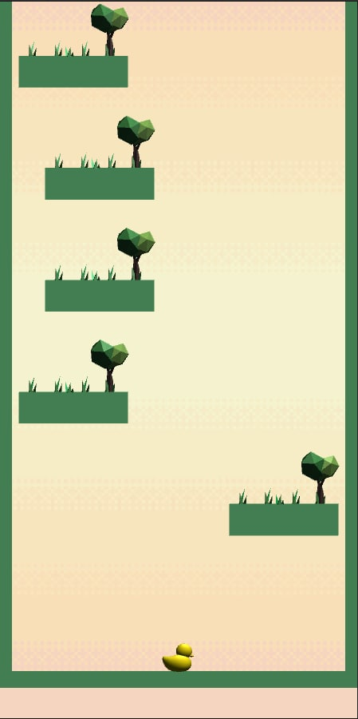

# DuckDuckGame Documentation
# IN GAME IMAGE


# INSTALLATION PROGRAMS
# UNITY
### Unity Hub version 3.3.0
[UNITY HUB INSTALL!](https://unity3d.com/get-unity/download/archive)
#
### Modules in Unity
#### Android 
##### (Downloading from unity hub)
#
### Unity version 2021.3.5f1 LTS
[UNITY INSTALL!](https://unity3d.com/get-unity/download/archive)
#

# GIT
[GIT INSTALL!](https://git-scm.com/downloads)

#
#
#
# Project Setup
```
First step 

git clone git@github.com:MertAkdag/DuckDuckGame.git

Second step
Open this repo in the Unity Editor

Third step
ENJOY, now you have an open unity and project files 🥳

```
#
#
#
# Tools Used Over Project Development
## Photoshop
## Visual studio code IDE
## unity Cinemachine
[Trees in game](https://assetstore.unity.com/packages/3d/environments/low-poly-style-nature-66322)

[Background](https://caniaeast.itch.io/simple-sky-pixel-backgrounds)


